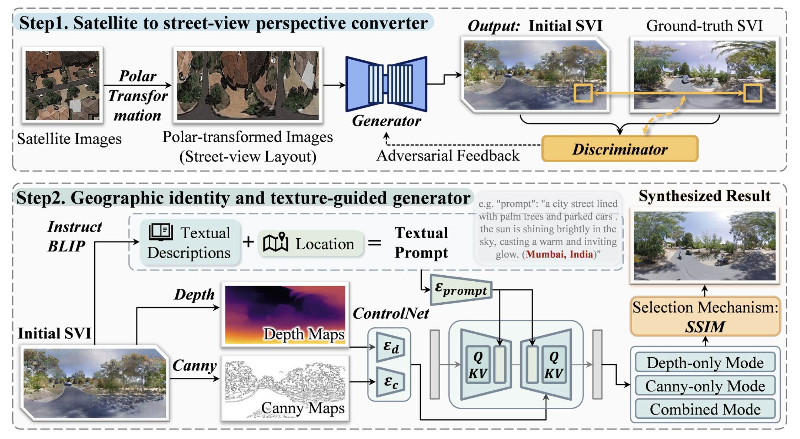

# GeoIdentity-Sat2Street



Official code release for **"Bridging street view coverage disparities through geographic identity preserving generation from satellite view"**

> Zongrong Li, Fan Zhang, Shaoqing Dai, Wufan Zhao  
> *ISPRS Journal of Photogrammetry and Remote Sensing*, 236 (2026) 622–639  
> DOI: [10.1016/j.isprsjprs.2026.03.049](https://doi.org/10.1016/j.isprsjprs.2026.03.049)

---

## Overview

Street view imagery (SVI) is a critical data source for urban research, but its global coverage is highly uneven — developed cities average 80–96% road coverage while many cities in the Global South fall below 40%. **GeoIdentity-Sat2Street** addresses this gap by synthesizing realistic, geographically faithful street view images directly from globally available satellite imagery.

The pipeline runs in two stages:

**Stage 1 — Viewpoint Conversion (GAN)**
A polar coordinate transformation maps satellite images into a panoramic-like layout, which is then refined by a Pix2PixHD conditional GAN to produce coarse street-level views.

**Stage 2 — Geographic Identity Refinement (Diffusion)**
A Stable Diffusion model conditioned on (1) a semantic caption generated by InstructBLIP, (2) explicit location metadata (city, country), and (3) structural priors (depth map + Canny edges via ControlNet) refines the coarse view into a final output that preserves region-specific visual identity.

```
Satellite image
    │
    ├─ Step 1a: Polar Transformation       (step1_polar_transform.py)
    │
    ├─ Step 1b: Pix2PixHD GAN              (step1_gan_inference.py)
    │           → coarse street view
    │
    ├─ Step 2a: Caption Generation         (step2_caption_generation.py)
    │           InstructBLIP + LaMini-T5 + location tag
    │
    └─ Step 2b: Diffusion Refinement       (step2_diffusion_refiner.py)
                ControlNet (depth + canny) + fine-tuned UNet
                → final street view
```

---

## File Structure

```
GeoIdentity-Sat2Street/
├── step1_polar_transform.py     # Stage 1a: satellite → polar-transformed image
├── step1_gan_inference.py       # Stage 1b: polar image → coarse street view (Pix2PixHD)
├── step2_caption_generation.py  # Stage 2a: coarse street view → semantic caption (JSONL)
├── step2_diffusion_refiner.py   # Stage 2b: caption + priors → refined street view (SD)
├── run_pipeline.py              # End-to-end inference (chains all four steps)
├── train_gan.py                 # Training: Pix2PixHD GAN
├── train_unet.py                # Training: SD UNet fine-tuning
└── requirements.txt
```

---

## Installation

```bash
# 1. Clone this repo
git clone https://github.com/ai4city-hkust/GeoIdentity-Sat2Street
cd GeoIdentity-Sat2Street

# 2. Install dependencies
pip install -r requirements.txt

# 3. Clone Pix2PixHD (required for Stage 1b)
git clone https://github.com/NVIDIA/pix2pixHD
pip install dominate tensorboardX
```

**Requirements:** Python 3.9+, CUDA GPU (≥16 GB VRAM recommended for Stage 2).

---

## Inference

### Option A — Full pipeline (one command)

```bash
python run_pipeline.py \
    --satellite_dir  /path/to/satellite_images \
    --output_dir     /path/to/output \
    --city           Kathmandu \
    --country        Nepal \
    --gan_ckpt       /path/to/latest_net_G.pth \
    --unet_ckpt      /path/to/unet_epoch_14.pt \
    --pix2pix_root   ./pix2pixHD
```

Output subdirectories created automatically:
```
output/
├── 1_polar/        ← polar-transformed satellite images
├── 2_coarse_gan/   ← GAN-synthesized coarse street views
├── 3_captions.jsonl
└── 4_refined/      ← final geographic-identity-preserved street views
```

### Option B — Step by step

```bash
# Step 1a: Polar transformation
python step1_polar_transform.py \
    --input_dir  /path/to/satellite \
    --output_dir /path/to/polar

# Step 1b: GAN coarse synthesis
python step1_gan_inference.py \
    --polar_dir      /path/to/polar \
    --output_dir     /path/to/coarse \
    --pix2pix_root   ./pix2pixHD \
    --checkpoint_path /path/to/latest_net_G.pth

# Step 2a: Caption generation (with location tag)
python step2_caption_generation.py \
    --image_dir    /path/to/coarse \
    --output_jsonl /path/to/captions.jsonl \
    --city         Kathmandu \
    --country      Nepal

# Step 2b: Diffusion refinement
python step2_diffusion_refiner.py \
    --captions_jsonl /path/to/captions.jsonl \
    --output_dir     /path/to/refined \
    --unet_ckpt      /path/to/unet_epoch_14.pt
```

**Notes:**
- `--city` / `--country` are optional. When omitted, no location tag is appended to captions (useful for ablation).
- `--unet_ckpt` is optional. When omitted, the vanilla SD v1.5 UNet is used.

---

## Training

### Stage 1 — Train the GAN

Prepare a dataset with paired images:
```
data/SAT2SVI/
├── train_A/    ← polar-transformed satellite images
├── train_B/    ← ground-truth street view panoramas
├── test_A/
└── test_B/
```

```bash
python train_gan.py \
    --data_dir     ./data/SAT2SVI \
    --pix2pix_root ./pix2pixHD \
    --name         sat2svi_pix2pix \
    --niter        100 \
    --niter_decay  100 \
    --batch_size   4
```

Trained checkpoint saved to:
`pix2pixHD/checkpoints/sat2svi_pix2pix/latest_net_G.pth`

### Stage 2 — Fine-tune the UNet

**Step 1:** Generate captions for your training images (include location tag).
```bash
python step2_caption_generation.py \
    --image_dir    ./data/SAT2SVI/train_B \
    --output_jsonl ./captions_train.jsonl \
    --city         New York \
    --country      "United States"
```

**Step 2:** Fine-tune the UNet.
```bash
python train_unet.py \
    --captions_jsonl ./captions_train.jsonl \
    --output_dir     ./unet_checkpoints \
    --num_epochs     15 \
    --batch_size     4 \
    --lr             1e-5
```

Checkpoints saved every 5 epochs: `unet_checkpoints/unet_epoch_N.pt`

---

## Datasets

| Dataset | Description | Used for |
|---|---|---|
| [CVUSA](https://mvrl.cse.wustl.edu/datasets/cvusa/) | US satellite–street pairs | GAN & UNet training / evaluation |
| [CVACT](https://github.com/Liumouliu/OriCNN) | Australia satellite–street pairs | GAN & UNet training / evaluation |
| MultiCities Dataset | 50,000 pairs across 5 cities on 5 continents (Mumbai, Amsterdam, New York, São Paulo, Sydney) | Geographic identity evaluation |

---

## Citation

```bibtex
@article{li2026geoidentity,
  title   = {Bridging street view coverage disparities through geographic identity preserving generation from satellite view},
  author  = {Li, Zongrong and Zhang, Fan and Dai, Shaoqing and Zhao, Wufan},
  journal = {ISPRS Journal of Photogrammetry and Remote Sensing},
  volume  = {236},
  pages   = {622--639},
  year    = {2026},
  doi     = {10.1016/j.isprsjprs.2026.03.049}
}
```

---

## Contact

For any questions related to the code, please contact **Zongrong Li** at [zongrong0122@gmail.com](mailto:zongrong0122@gmail.com).

---

## License

This project is released under the [MIT License](LICENSE).  
The Pix2PixHD submodule is subject to its own license; see [NVIDIA/pix2pixHD](https://github.com/NVIDIA/pix2pixHD).
